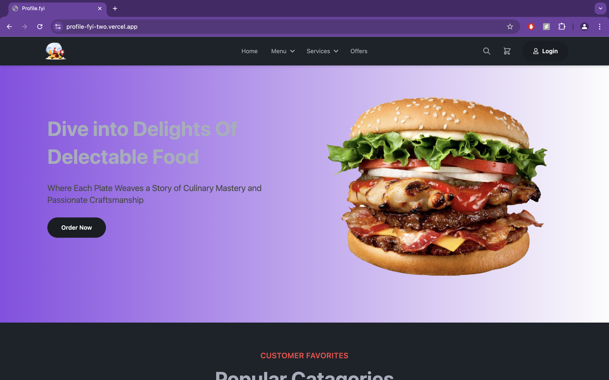
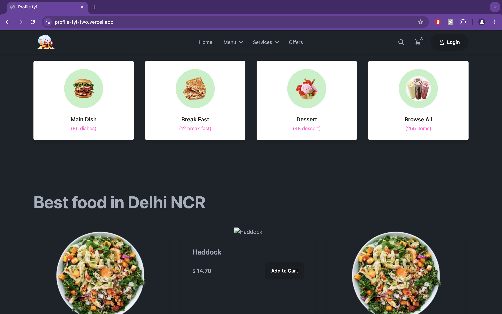
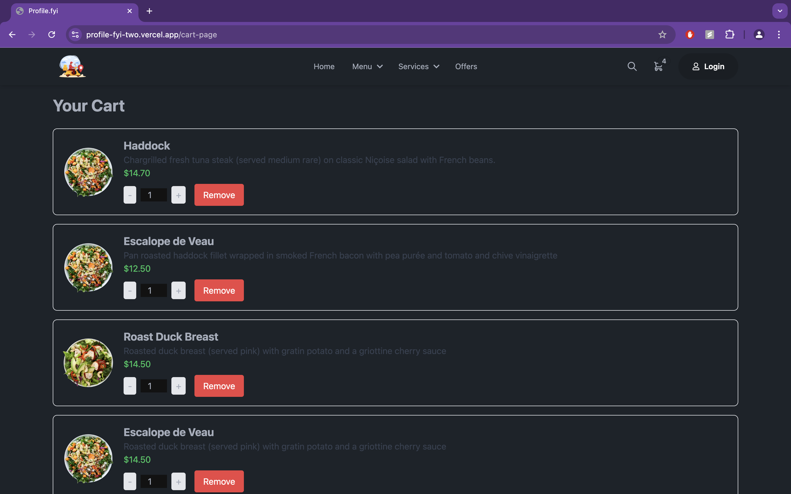

# [Frontend Application](<[https://travel-saathi.netlify.app/](https://food-app-client-three.vercel.app)>)

## 📌 Introduction

[](https://awesome.re)

This repository contains the frontend code for a food ordering web application. Built with React and modern web technologies, this application offers a user-friendly and responsive interface for browsing menus, managing carts, and placing orders.

## 🚀 View Live Demo


<pre><center><a href="https://food-app-client-three.vercel.app"><b>https://food-app-client-three.vercel.app</b></a></center></pre>

## 🛠️ Installation Steps

Star and Fork the Repo 🌟 and this will keep us motivated.

1. Clone the repository

```bash
git clone https://github.com/subhashdippu/FastFeast.git
```

2. Change the working directory

```bash
cd FastFeast
```

3. Install dependencies

```bash
npm install
```

4. Run the app

```bash
npm run start
```

## 📸 Screenshots





impot
